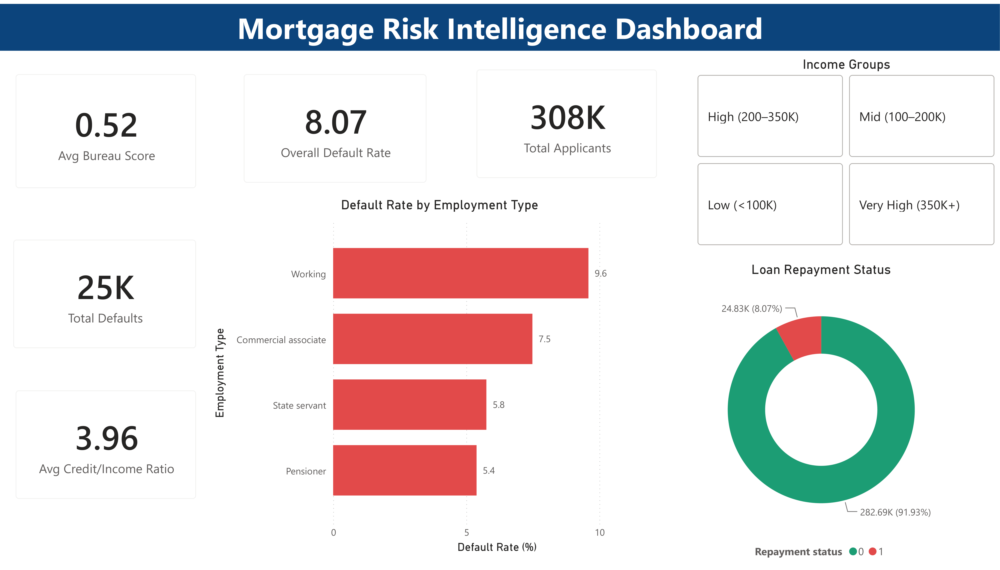

# Mortgage Risk & Approval Intelligence Dashboard

## Overview
End-to-end mortgage risk intelligence pipeline analysing **307,511 loan applications**
from the Home Credit Default Risk dataset. Built a complete data pipeline from raw
data cleaning in Python → SQL analysis → 5-page interactive Power BI dashboard.

## Live Dashboard
🔗 **[View Interactive Power BI Dashboard →](https://app.powerbi.com/groups/me/reports/d6980292-9bda-4277-9b9c-b8a0d710530a/6b79ebd6cd8685447d00?redirectedFromSignup=1&experience=power-bi)**

## Key Findings
| Finding | Detail |
|---|---|
| Overall default rate | 8.07% across 307,511 applicants |
| Riskiest segment | Unverified Working + Low Income = 12.01% default rate |
| Bureau score impact | Unverified applicants default 20% higher (9.31% vs 7.77%) |
| Age risk gap | Under-30 applicants default at 11.46% vs 5.72% for 50+ |
| Education gap | Lower secondary 10.93% vs Academic degree 1.83% |

## Recommendations
1. **Verification mandate** - Require bureau score for all loans above 1,00,000;
   addresses 60,965 unverified applicants
2. **Age-based monitoring** - 6-month check-in protocol for under-30
   first-time borrowers; targets 45,000 high-risk applicants
3. **Income-linked loan caps** - Cap at 4× annual income for sub-100K bracket;
   reduces exposure for 63,698 highest-ratio applicants

## Tech Stack
| Tool | Purpose |
|---|---|
| Python (pandas, matplotlib, seaborn) | Data cleaning, feature engineering, EDA |
| SQL (SQLite) | Aggregation, segmentation, risk queries |
| Power BI + DAX | 5-page interactive dashboard |

## Feature Engineering
Three risk-ratio features engineered from raw columns:
- `CREDIT_INCOME_RATIO` - loan amount ÷ annual income
- `ANNUITY_INCOME_RATIO` - annual repayment ÷ annual income  
- `DAYS_EMPLOYED_RATIO` - employment duration ÷ applicant age

## Dashboard Pages
| Page | Description |
|---|---|
| Executive Summary | KPI cards, overall default rate, employment type breakdown |
| Applicant Profile | Education, age group, occupation analysis |
| Risk Heatmap | Employment × Income Band matrix with conditional formatting |
| Bureau Flag Analysis | Verified vs unverified default rates, riskiest segments |
| Recommendations | 3 data-driven business recommendations |

## Dataset
- **Source:** [Home Credit Default Risk - Kaggle](https://www.kaggle.com/c/home-credit-default-risk)
- **Size:** 307,511 rows × 122 columns
- **Target variable:** Binary (0 = repaid, 1 = defaulted)
- **Class imbalance:** ~8% default rate

## Project Structure

    notebooks/mortgage_cleaning_eda.ipynb  ← Python cleaning + EDA
    sql/                                   ← 6 analysis queries  
    screenshots/                           ← Dashboard page screenshots
    assets/eda_plots.png                   ← Python EDA output

## How to Run
1. Download `application_train.csv` from Kaggle link above
2. Run `notebooks/mortgage_cleaning_eda.ipynb` top to bottom
3. Open `mortgage.db` in DB Browser for SQLite, run queries from `sql/`
4. Open Power BI Desktop, connect to `mortgage_clean.csv`
